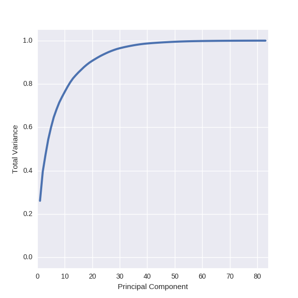
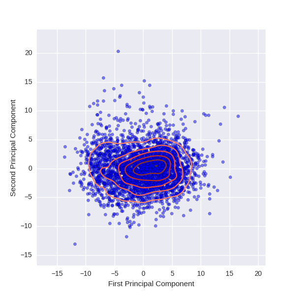

# Project 1

Can we connect the utilization and quality of healthcare services to ACO performance?  Lets see ....


# Getting Started


## Get the Data

A script is provided (`get_data.sh`) that will create a `data` directory, download the CMS data, and convert the sheets in the geographic variation public use excel file to CSVs (one CSV for each year).  In order for the script to work you will need to have `wget` installed on your mac.  This can be done with homebrew using the command `brew install wget`.  We convert the excel files to CSVs because the Pandas excel file parser is really slow.  The conversion process will take a few minutes, but subsequent reading of the CSV files should take less than a second.

```shell
> ./get_data.sh
```

When the script is complete the `data` directory should look like this,

```
├── data
│   ├── County_All_Table_2007.csv
│   ├── County_All_Table_2008.csv
│   ├── County_All_Table_2009.csv
│   ├── County_All_Table_2010.csv
│   ├── County_All_Table_2011.csv
│   ├── County_All_Table_2012.csv
│   ├── County_All_Table_2013.csv
│   ├── County_All_Table_2014.csv
│   ├── County_All_Table.xlsx
│   ├── Medicare_Shared_Savings_Program_Accountable_Care_Organizations_Performance_Year_2014_Results.csv
│   └── State_County_Table_All.zip
```


## Run the Python


### Explore

The `explore.py` script shows an example of the `pairplot` method from the plotting library [seaborn](https://stanford.edu/~mwaskom/software/seaborn).  This is a quick and dirty way to see correlations between pairs of variables,


### PCA Analysis

There are 244 columns in the geographical variation data set.  In principal, all of these are potential features in a machine learning model.  In practice, there are some that just arent good candidates.  For example, per capita spending is a better way to compare two counties than total spending.  In addition, some columns are "sparse" in the sense that many rows are missing data. For example, the columns describing LTCH spending have missing values for approximately half the counties.  But, even if we restrict ourselves to "per capita" style columns that are not sparse, we still have around 83 left.  Principal component analysis is a powerful tool that allows us to reduce the dimensionality of our data (i.e. use fewer columns) by eliminating degeneracies.  In the plot below we show the total variance captured as a function of principal components included.



The plot shows that almost all the variance is captured in the first 40 principal components and that 40% of the variance is captured in just 2 principal components.  If we plot the first two principal components in a scatter plot we get the following plot,



Without doing any sophisticated analysis, it doesn't seem like there are multiple well defined groups.  If we were going to design an outlier detection algorithm for this distribution a single multivariate gaussian might be a good approach.


# Data Sources

## Geographic Variation Public Use Files

So far looking at the State/County Table file.  It includes demographic, total cost, service level cost, readmission, and ED visit data for 2007-2014.


 * [Geographic Variation PUFs](https://www.cms.gov/Research-Statistics-Data-and-Systems/Statistics-Trends-and-Reports/Medicare-Geographic-Variation/GV_PUF.html)

 * [State/County Table File](https://www.cms.gov/Research-Statistics-Data-and-Systems/Statistics-Trends-and-Reports/Medicare-Geographic-Variation/Downloads/State_County_Table_All.zip)

> The Centers for Medicare & Medicaid Services (CMS) has developed data that enables researchers and policymakers to evaluate geographic variation in the utilization and quality of health care services for the Medicare fee-for-service population.  We have aggregated this data into a Geographic Variation Public Use File that has demographic, spending, utilization, and quality indicators at the state level (including the District of Columbia, Puerto Rico, and the Virgin Islands), hospital referral region (HRR) level, and county level.

> The Geographic Variation Public Use File has twelve separate files – two files with state and county-level data, four files with only state-level data, and six files with HRR-level data.  The files are presented in two different formats.  The “Table” files present indicators for all states, counties, or HRRs, and can easily be exported from Excel to another data analysis program for additional analysis, while the corresponding “Report” files allow users to compare a specific state, county, or HRR to national Medicare benchmarks.  The state- and HRR-level data are presented for beneficiaries under the age of 65, beneficiaries that are 65 or older, and all beneficiaries regardless of age.  However, the county-level data are only available for all beneficiaries.  Each file has a brief Methods section outlining the sample population and methodology that we used to calculate these indicators and a Documentation section which explains the individual indicators in more detail.  Finally, there is also a Methodological Overview paper and a Technical Supplement on Standardization that provides additional information on the methodology that we used to standardize claim payment amounts.


## ACO Performance Data 2014

 * [MSSP ACO 2014 Results](https://data.cms.gov/ACO/Medicare-Shared-Savings-Program-Accountable-Care-O/ucce-hhpu)

> This dataset presents data on Calendar Year 2014 financial reconciliation and quality performance results for ACOs with 2012, 2013 and 2014 agreement start dates. ACOs that generated savings earned a performance payment if they met the quality standard. Quality performance for ACOs with 2014 start dates that are in their first performance year is based on complete and accurate reporting of all required quality measures for Calendar Year 2014.


# Acronym Guide

 * `ACO` Acountable Care Organization
 * `ASC` Ambulatory Surgery Center
 * `CMS` Centers for Medicare & Medicaid Services
 * `DME` Durable Medical Equipment
 * `ED` Emergency Department
 * `E&M` Evaluation and Management
 * `FQHC` Federally Qualified Health Center
 * `HH` Home Health
 * `HRR` Hospital Referral Region
 * `IP` Hopital Inpatient
 * `IRF` Inpatient Rehabilitation Facility
 * `LTCH` Long Term Care Hospital
 * `MSSP` Medicare Shared Savings Program
 * `OP` Hospital Outpatient
 * `PUF` Public Use File
 * `RHC` Rural Health Center
 * `SNF` Skilled Nursing Facility
